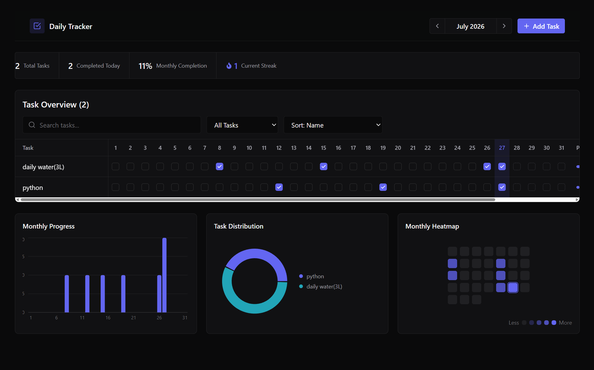
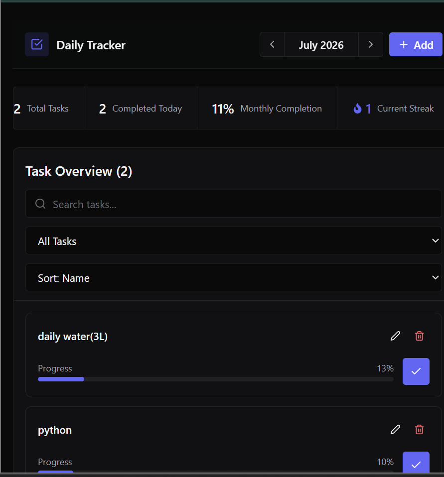
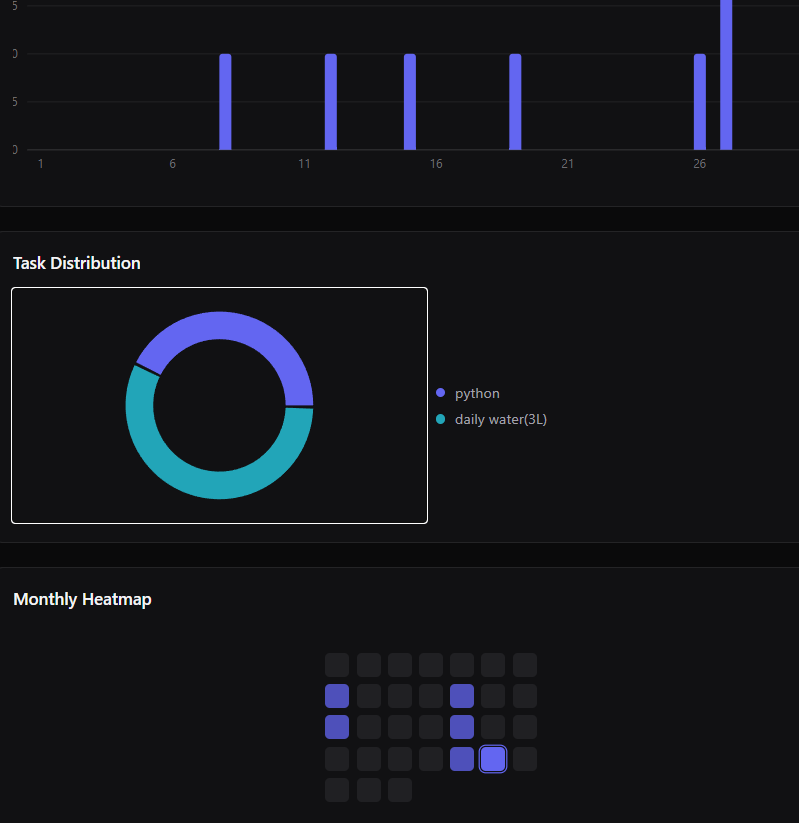

# Daily Tracker

A full-stack personal habit tracking application built to manage daily tasks, track completion, and visualize productivity progress.

## Tech Stack

### Frontend
- React
- Vite
- Tailwind CSS

### Backend
- Node.js
- Express.js

### Database
- MySQL

## Features

- Create daily tasks
- Edit and delete tasks
- Track daily completion
- Monthly progress analytics
- Heatmap visualization
- Responsive design for desktop and mobile

## Project Structure
Daily-Tracker-Full-Stack/
│
├── frontend/
│ └── tracker-app/
│
└── backend/
└── tracker-backend/


## Screenshots

### Dashboard



### Mobile View





## Run Locally

### Frontend

```bash
cd frontend/tracker-app

npm install

npm run dev
cd backend/tracker-backend

npm install

npm start


Then push:

```powershell
git add README.md
git commit -m "Improve README documentation"
git push
